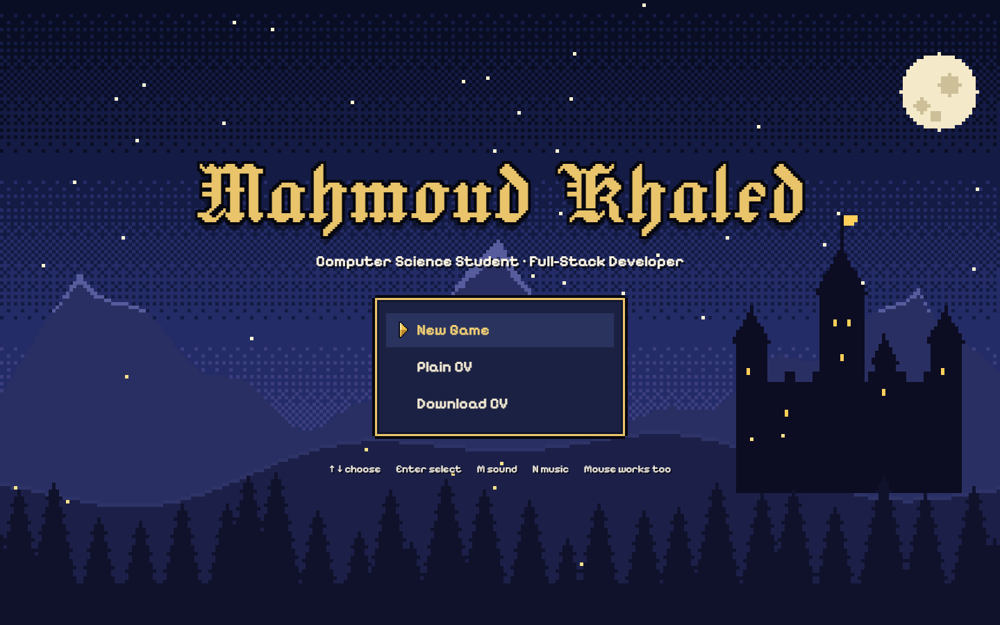
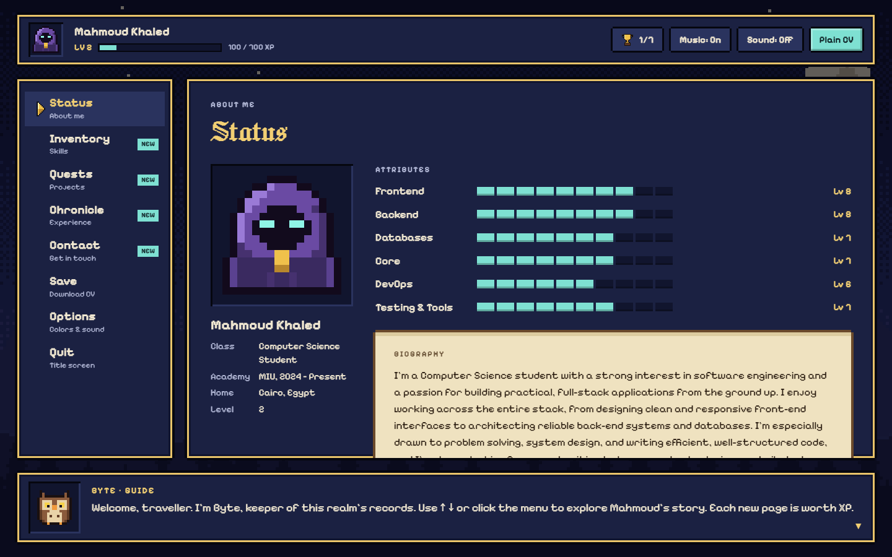
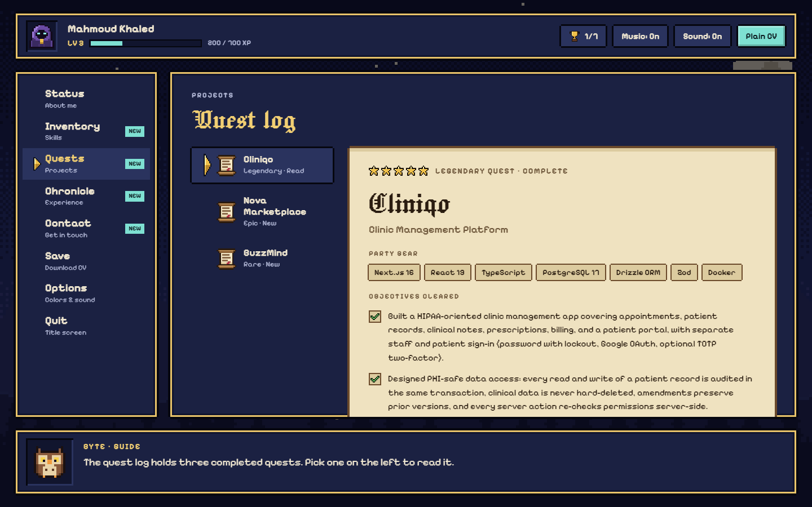
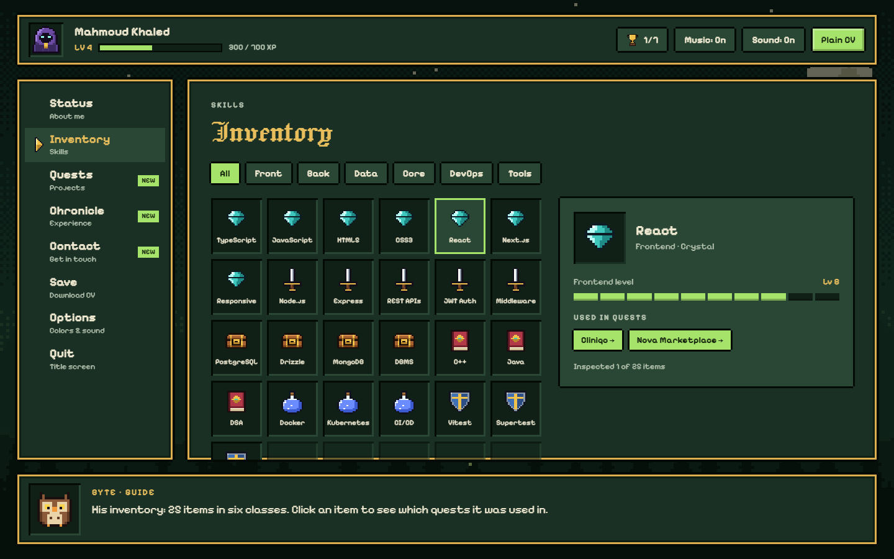
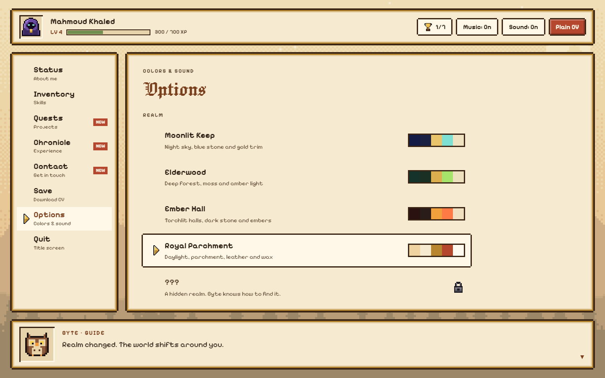
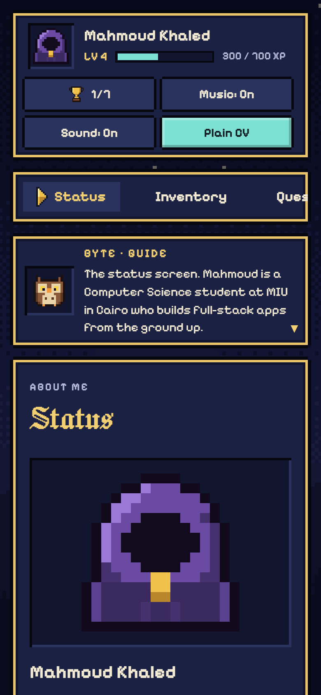

# Mahmoud Khaled — Portfolio

A portfolio and CV presented as a retro RPG. Start a new game, explore the menu, earn XP and trophies, and find the secret realm. Or skip the game and read everything on one plain page.

<!-- After deploying, add the link here, e.g.  **Live site:** https://your-site.example -->

<p align="center">
  
</p>

<table>
  <tr>
    <td width="50%"></td>
    <td width="50%"></td>
  </tr>
  <tr>
    <td align="center"><b>Status</b>: profile, skill levels and bio</td>
    <td align="center"><b>Quest log</b>: projects as completed quests</td>
  </tr>
  <tr>
    <td></td>
    <td></td>
  </tr>
  <tr>
    <td align="center"><b>Inventory</b>: skills, linked to the projects that used them</td>
    <td align="center"><b>Options</b>: five colour realms, one of them hidden</td>
  </tr>
</table>

## Features



- **Eight menu screens**: Status, Inventory (25 skills in six classes), Quests (three projects), Chronicle (education, internships and volunteering), Contact, Save (CV download), Options and Quit.
- **XP and trophies**: the About, Skills, Experience and Contact screens and each of the three projects are worth 100 XP the first time you open them, up to 700 XP and level 8. There are seven trophies to unlock.
- **Byte the owl** comments on every screen in typed-out dialogue, with a chirping voice when sound is on.
- **Five colour realms** re-theme the interface and the world behind it. One stays locked until you find the secret.
- **An animated pixel-art world** painted on a 320×180 canvas: a dithered sky, twinkling stars, a castle, fireflies and parallax that follows the mouse.
- **Classical music in chiptune**: Minuet in G, Canon in D, Für Elise and Ode to Joy, arranged for 8-bit voices and played by a small Web Audio sequencer. It starts with New Game, dips under reward jingles and pauses in a hidden tab. Press **N** or use the HUD button to turn it off, or pick a piece in Options → Jukebox.
- **34 chiptune sound effects**, synthesised live with the Web Audio API. They're on from the start; press **M** or use the HUD button to turn them off. A Sound test in Options plays 24 of them.
- **Plain CV mode**: the whole CV on one readable page, plus a PDF download.
- **Works on phones**: a single-column layout with a sticky tab strip.
- **Accessible**: full keyboard control, dialogs take focus and hand it back, screen readers hear Byte's lines and trophy alerts, and the typing and blinking animations switch off when the system asks for reduced motion.
- **Drawn in code**: every sprite is stored as run-length-encoded text and painted to a canvas at load time, so the site ships no image files apart from its favicon.

<br clear="right">

## Tech stack

React 19 · Vite 8 · plain CSS with custom properties · Canvas 2D · Web Audio API

The only runtime dependencies are `react` and `react-dom`.

## Getting started

You need [Node.js](https://nodejs.org/) 20.19+ or 22.12+.

```bash
npm install
npm run dev
```

Then open http://localhost:5173.

| Command | What it does |
| --- | --- |
| `npm run dev` | Start the dev server with hot reload |
| `npm run build` | Build the static site into `dist/` |
| `npm run preview` | Serve the built site locally, to check it before deploying |

## Project structure

```text
portfolio/
├── public/
│   ├── Mahmoud_Khaled_CV.pdf   the CV offered for download
│   └── favicon.svg             the hooded-mage tab icon
├── screenshots/                images for this README (not deployed)
├── src/
│   ├── data.js                 all the content: bio, skills, projects, experience, contacts, Byte's lines, defaults
│   ├── App.jsx                 game state: scenes, XP, trophies, sounds, keyboard controls
│   ├── world.js                the colour realms and the animated background
│   ├── sprites.js              pixel-art icons as run-length-encoded rows
│   ├── sfx.js                  the sound engine and all 34 effects
│   ├── music.js                the music player: a small step sequencer and the playlist
│   ├── tracks.js               the four classical pieces, written as notes
│   ├── styles.css              pixel frames, layout and the phone layout
│   ├── main.jsx                entry point
│   └── components/
│       ├── TitleScreen.jsx
│       ├── GameScreen.jsx      HUD, side menu and content panel
│       ├── GuideBox.jsx        Byte the owl
│       ├── PlainCV.jsx         the one-page CV
│       ├── Overlays.jsx        trophy toast, trophies list, secret dialog
│       ├── Pixel.jsx           shared pixel-UI pieces
│       └── tabs/               one file per menu screen
├── index.html
└── vite.config.js
```

## Customising

Almost all the content lives in `src/data.js`:

| To change | Edit |
| --- | --- |
| Name, tagline and bio | `PROFILE` |
| Skills | `ITEMS` (one row per skill) and `CATS` (the six classes and their levels, 1–10) |
| Projects | `QUESTS` |
| Education and experience | `CHRONICLE` |
| Contact links | `CONTACTS` |
| What Byte says | `LINES` |
| Starting realm, music, sound, Byte's voice, guide, scanlines and first screen | `DEFAULTS` |

A skill row looks like `['react', 'fe', 'React', 'React', [0, 1]]`: id, class, short name, full name, and the projects that used it (`0` is the first entry in `QUESTS`). The inventory has room for 30 skills.

To replace the CV, overwrite `public/Mahmoud_Khaled_CV.pdf`. If the new file has a different name, update `PROFILE.cvFile` too.

> [!NOTE]
> **Adding or removing a project?** The XP system currently expects exactly three. Along with the `QUESTS` entry, add a Byte line (`q3`, …) to `LINES` and a key to `XP_KEYS` in `src/data.js`. Then update the three-quest checks in `src/App.jsx` and `src/components/GameScreen.jsx`, the XP total (7 steps, 700 XP) in `GameScreen.jsx`, and any text that mentions three quests.

Other things you can tweak:

- **Colours**: each realm in `src/world.js` has a `ui` palette for the interface and a `w` palette for the world.
- **Pixel art**: in `src/sprites.js`, a row like `'3. 2k 1O'` means 3 transparent pixels, 2 pixels of colour `k`, then 1 of colour `O`.
- **Sounds**: each effect in `src/sfx.js` is a list of notes, and the comment at the top of the file explains the format. Add an effect to `SOUND_TEST` to list it in the sound test.
- **Music**: each piece in `src/tracks.js` is a few voices written as notes, like `D5/4 G4/2 -/2 |`: a note and its length in sixteenths, `-` for a rest and `|` for a bar line. Add a piece to `TRACKS` and it joins the playlist and the Jukebox. In the dev build, the console warns about any bar that doesn't add up. To make the music quieter or louder, change `VOLUME` in `src/music.js`.

## Deploying

`npm run build` writes a static site to `dist/`. Asset paths are relative, so it works at a domain root or in a sub-folder such as `username.github.io/portfolio/`.

- **Netlify, Vercel or Cloudflare Pages**: import the repository, set the build command to `npm run build` and the output folder to `dist`.
- **GitHub Pages**: run `npm run build`, then `npx gh-pages -d dist` to publish `dist/` to a `gh-pages` branch. In the repository's **Settings → Pages**, choose to deploy from that branch.

## Controls

| Key | Action |
| --- | --- |
| ↑ / ↓ | Move through the menu |
| Enter | Select |
| Esc | Close a dialog |
| N | Music on or off |
| M | Sound effects on or off |

The mouse and touch work everywhere too.

<details>
<summary>The secret (spoiler)</summary>

Byte reveals it once you've seen everything, but it works any time: **↑ ↑ ↓ ↓ ← → ← → B A**. It sets you to level 3 and unlocks the Arcane realm.

</details>

## Credits

Fonts from Google Fonts: Jacquard 24, Pixelify Sans and Figtree, all under the SIL Open Font License.

Music: public-domain compositions by Christian Petzold (Minuet in G, long credited to J. S. Bach), Johann Pachelbel (Canon in D) and Ludwig van Beethoven (Für Elise, Ode to Joy), arranged for this site.

## Contact

**Mahmoud Khaled**, Cairo, Egypt

- Email: [mahmoud1412007@gmail.com](mailto:mahmoud1412007@gmail.com)
- LinkedIn: [linkedin.com/in/mahmoud-khaled-793892347](https://linkedin.com/in/mahmoud-khaled-793892347)
- GitHub: [github.com/Nameless770](https://github.com/Nameless770)
